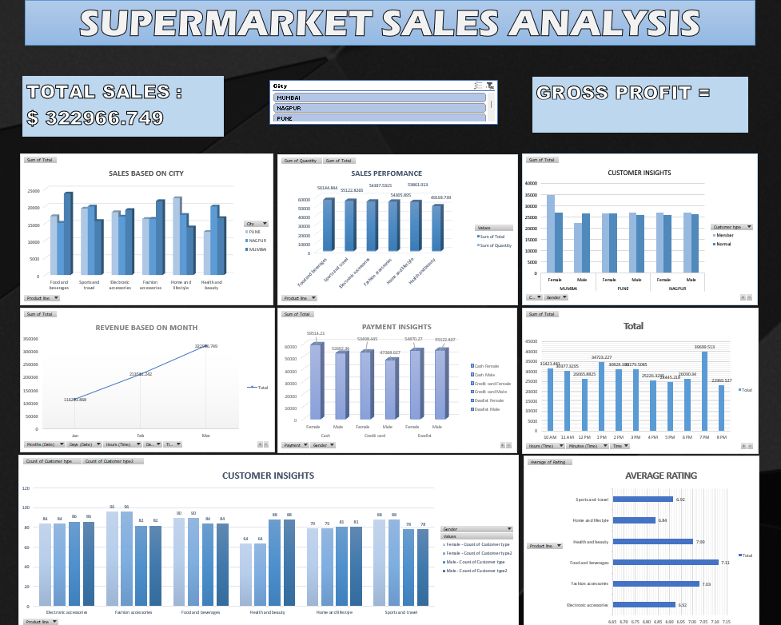

# Supermarket Sales Analysis Dashboard

## Overview
This project is an Excel-based **Supermarket Sales Analysis Dashboard** that provides a detailed visualization and insights into the sales data of a supermarket. It uses various charts and graphs to analyze sales performance, customer insights, payment trends, and more.

## Features
1. **Total Sales and Gross Profit:**
   - Displays the total sales value and gross profit earned.

2. **Sales Based on City:**
   - Analyzes sales distribution across different cities (e.g., Yangon, Mandalay, Naypyitaw).

3. **Sales Performance:**
   - Monthly performance metrics for tracking sales progress.

4. **Customer Insights:**
   - Analyzes customer gender distribution and preferences.

5. **Revenue Trends Based on Month:**
   - Tracks revenue growth over time (monthly breakdown).

6. **Payment Insights:**
   - Compares different payment methods (e.g., Cash, Credit Card, E-wallet) and their contributions to overall sales.

7. **Category-Wise Sales:**
   - Highlights sales distribution across product categories:
     - Food and Beverages
     - Fashion Accessories
     - Electronics Accessories
     - Home and Lifestyle
     - Health and Beauty

8. **Average Rating by Product Category:**
   - Customer feedback ratings for various product categories.

## Technologies Used
- **Microsoft Excel**
  - Pivot Tables
  - Charts (Bar, Line, and Column charts)
  - Conditional Formatting
  - Data Visualization techniques

## Objectives
The main goal of this dashboard is to:
- Identify sales patterns and trends.
- Understand customer behavior and preferences.
- Evaluate the performance of product categories and payment methods.
- Provide actionable insights for decision-making and strategy planning.

## Insights Derived
- **City Insights:** Sales performance varies significantly between cities.
- **Customer Gender Insights:** Balanced sales contributions from male and female customers.
- **Payment Trends:** E-wallet is a popular payment method, followed by cash.
- **Seasonal Revenue:** Sales show consistent growth month over month.
- **Average Ratings:** High customer satisfaction in categories like "Health and Beauty."

## Dashboard Preview
&nbsp;
